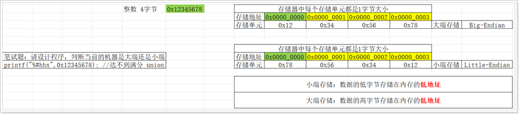
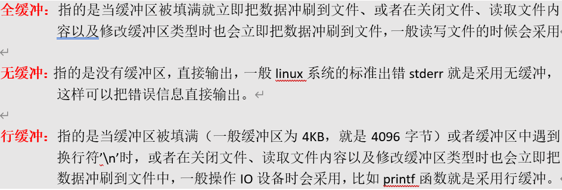
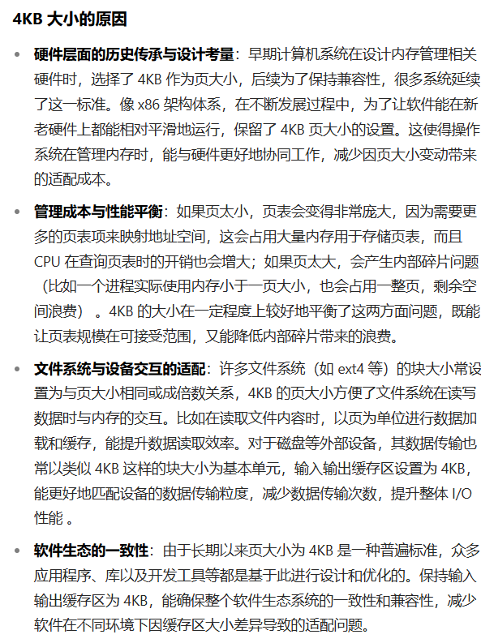
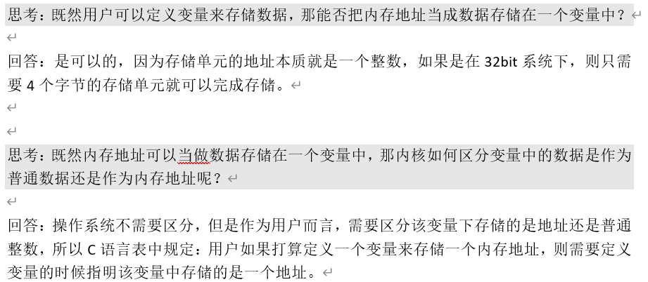
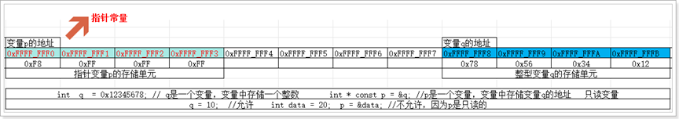
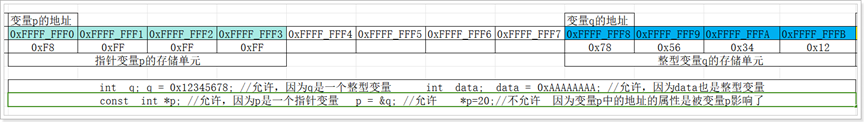

# 面向过程
- 面向过程是指在解决某个问题的过程中,先把问题分解成子问题,然后逐步解决子问题,最终得到整体的解决方案、
- 将问题分解为一系列步骤（函数或过程），通过依次调用这些步骤来解决问题。数据和操作数据的函数是分离的。

# 面向对象 
- 面向对象是指在解决某个问题的过程中,先把问题分解成对象,然后逐步解决对象,最终得到整体的解决方案
- 将问题分解为对象，对象是数据（属性）和操作数据的方法（函数）的封装体。通过对象间的交互来解决问题。

# 头文件<>和""的区别
< xxxh >:编译器只去系统指定路径中查找该头文件,如果未找到,则编译器进行错误提示。
"xxx.h":先去当前路径中查找头文件,未找到再去系统路径中查找,还未找到则报错提示。

# 大端小端
注意：计算机内部存储多字节的数据时会涉及到大端小端，不同的处理器架构采用的模式是不同的，
一般X86架构采用小端模式，ARM架构一般采用大端模式（但是并不绝对）！！！！！！

# 缓冲区
根据IO设备的不同，可以把缓冲区分为输入缓冲区和输出缓冲区，
同样，根据刷新形式的不同，可以把缓冲区分为三种：全缓冲、行缓冲、无缓冲。

# 分页机制
在 Linux 系统中，输入输出缓存区一般为 4KB 大小，这与 Linux 的内存分页机制紧密相关：
内存分页是一种内存管理方式，它把线性地址空间和物理地址空间划分成若干个大小相等的片，这些片就称为页 。在 x86 架构以及很多常见的系统架构中，页的大小通常被设置为 4KB 。其原理是通过页表这种数据结构，将线性地址（虚拟地址）映射到物理地址。比如，线性地址被划分成多个部分，其中一部分用于在页目录中索引，找到对应的页表，另一部分用于在页表中索引，找到对应的物理页框，最后一部分表示页内偏移量 ，从而确定最终的物理地址

# 计算优先级
运算符的结合性分为两种：一种是左结合性，遵循先左后右原则，比如 a + b - c，相当于(a+b)-c，
另一种是右结合性，遵循先右后左原则，比如双目运算符中的赋值运算符 = ，比如表达式a=b=c，相当于a=(b=c)。
注意：C语言中的单目运算符和三目运算符都是遵循右结合性，当然也包含双目运算符中的赋值运算符=，其他的运算符都遵循左结合性。
比如 表达式 ++i++ 如何解释？ 		回答：++(i++)  遵循右结合性
C语言中提供了6种位操作运算符，分别是  ~   &   ^   |    <<    >>，其中~属于单目运算符，其他五种都属于双目运算符。
C语言中一共提供了6种关系运算符，分别是 <  <=  >  >=  ==  != (后面两种优先级较低)，关系运算符都是双目运算符，都遵循左结合性
C语言中提供了3种逻辑运算符，分别是 &&   ||    ! ，对于逻辑与&&和逻辑或||都属于双目运算符，遵循左结合性，而逻辑非!属于单目运算符，遵循右结合性
还有一个逻辑运算符是 !  (逻辑非) ，属于一元运算符，只有一个操作对象，遵循右结合性，作用是把操作对象的逻辑取反（真变为假，假变为真）。
C语言中提供了1种条件运算符，符号是 ? : ，条件运算符是唯一的一个三目运算符，需要三个操作数。
C语言中提供了11种赋值运算符，如下图所示，都属于双目运算符，但是遵循右结合性！！！

# 指针

# 常量指针和指针常量
  //(1)	int *const p;常量指针的值是指针的地址，内容可以改变,地址不能改变
  //(2)	const int *p;指针常量的值是指针的地址，内容不能改变，但是地址可以改变